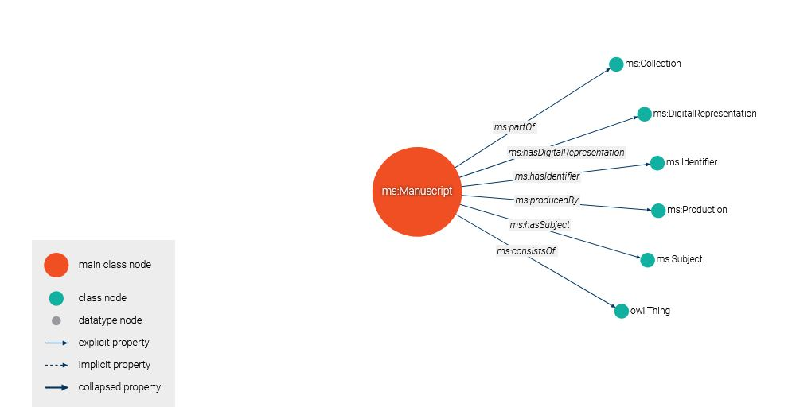
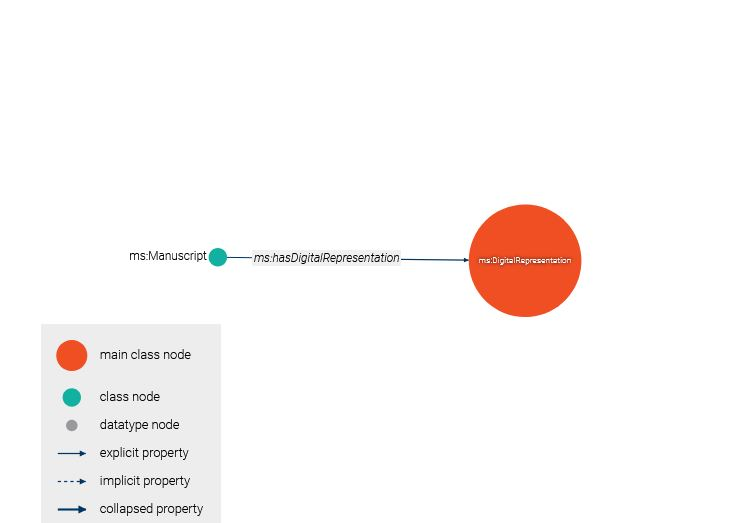

# Analysis of Openn Repository RDF Data

## Introduction
The TEI Ontology is a lightweight OWL (Web Ontology Language) ontology that defines classes, properties, and relationships to catalog digital resources in the OPenn collection. It integrates TEI metadata with Dublin Core terms to describe manuscripts, their digital representations, and associated metadata such as titles, creators, and formats. The ontology uses RDF (Resource Description Framework) and RDFS (RDF Schema) to structure knowledge, making it suitable for knowledge graph applications.

RDF excels at integrating data from various sources and making implicit data explicit. This is done through technologies like Load and Transfer pipelines, NER, and GraphDB storage. Below is a simplified process involving Pennsylvania’s OPEnn library from data harvesting to modeling discovered entities in a dynamic Knowledge Graph.

This document examines two RDF files from the Openn Repository, provided here in Turtle (TTL) format. They contain metadata for a manuscript and a taxonomy term, analyzing their structure, content, and role in the repository's knowledge graph.
The `CatalogeData` folder includes the full Turtle data compressed due to it's large file size, along with the `original TEI XML files` and `JSON serialization`. Both versions are identical.
For demonstration, the `SampleData` folder offers a subset of the data, with the full dataset available in compressed format.

## 1. Ontology 

## Key Components

### Prefixes and Namespaces
The ontology declares several standard prefixes to ground its vocabulary:
- `tei`: Custom namespace for TEI-specific terms (`http://www.tei-c.org/ns/1.0#`)
- `dct`: Dublin Core Terms (`http://purl.org/dc/terms/`)
- `owl`, `rdf`, `rdfs`: Standard ontologies for semantic web
- `xsd`: XML Schema Datatypes

These prefixes enable interoperability with existing semantic web standards.

### Classes
The ontology defines key classes to represent entities in the OPenn collection:
- `tei:TEI`: Represents a TEI-encoded document, typically a digitized manuscript.
- `tei:Manuscript`: Describes physical manuscripts, linked to their digital 
- `tei:DigitalRepresentation`: Models digital objects, such as images or transcriptions.
counterparts.


**Image 01**


Actual digital resource correponding to each folio of a particular manuscript is represented by `tei:DigitalRepresentation`: 

**Image 02**

### Properties
Properties connect entities and their metadata:
- Object Properties:
  - `tei:hasDigitalRepresentation`: Links a manuscript to its digital resource(s) (e.g., `Manuscript hasDigitalRepresentation DigitalRepresentation`).
  - `tei:isPartOf`: Indicates a resource is part of a collection.
- Data Properties (from Dublin Core):
  - `dct:title`: The title of a resource (e.g., a manuscript’s name).
  - `dct:creator`: The creator or author of the resource.
  - `dct:format`: The file format of a digital resource (e.g., PDF, JPEG).
  - `dct:identifier`: A unique identifier for the resource.

### Logical Structure
The ontology uses OWL to define class hierarchies and property constraints:
- `tei:DigitalRepresentation` and `tei:Manuscript` are subclasses of a generic resource concept, implicitly aligned with `owl:Thing`.
- Properties like `tei:hasDigitalRepresentation` have defined domains (`tei:Manuscript`) and ranges (`tei:DigitalRepresentation`), ensuring semantic consistency.

### SPARQL Query

This section provides sample SPARQL queries to demonstrate how to retrieve metadata from the [TEI Ontology](https://raw.githubusercontent.com/MehranDHN/KG4OPennResources/refs/heads/main/CatalogeData/TEIOntology.ttl) used for modeling digital resources in the OPenn collection. These queries are designed to work with a triple store (e.g., Apache Jena) containing the ontology and associated RDF data. 

## Prerequisites

- The `TEIOntology.ttl` file is loaded into a triple store.
- The ontology uses the following namespaces:
  - `tei`: `http://www.tei-c.org/ns/1.0#`
  - `dct`: `http://purl.org/dc/terms/`
- Queries assume RDF data describing manuscripts and digital resources, as per the ontology’s structure.

## Sample Queries

### 1. Retrieve All Manuscripts with Their Titles
This query fetches all resources classified as `tei:Manuscript` along with their `dct:title`.

```sparql
PREFIX tei: <http://www.tei-c.org/ns/1.0#>
PREFIX dct: <http://purl.org/dc/terms/>
SELECT ?manuscript ?title
WHERE {
  ?manuscript a tei:Manuscript ;
              dct:title ?title .
}
```


**Use Case**: List all manuscripts in the OPenn collection with their titles for catalog browsing.

### 2. Find Digital Resources for a Specific Manuscript
This query retrieves digital resources (e.g., PDFs, images) associated with a specific manuscript via `tei:hasDigitalRepresentation`.

```sparql
PREFIX tei: <http://www.tei-c.org/ns/1.0#>
PREFIX dct: <http://purl.org/dc/terms/>
SELECT ?digitalResource ?format ?identifier
WHERE {
  ?manuscript a tei:Manuscript ;
              dct:title "MS Codex 1234" ;
              tei:hasDigitalRepresentation ?digitalResource .
  ?digitalResource dct:format ?format ;
                  dct:identifier ?identifier .
}
```

**Use Case**: Retrieve digital representations (e.g., file formats and URLs) for a manuscript named “MS Codex 1234”.

### 3. List Resources by Creator
This query finds all resources (manuscripts or digital resources) associated with a specific creator.

```sparql
PREFIX tei: <http://www.tei-c.org/ns/1.0#>
PREFIX dct: <http://purl.org/dc/terms/>
SELECT ?resource ?title
WHERE {
  ?resource dct:creator "John Doe" ;
            dct:title ?title .
}
```

**Use Case**: Identify all items in the collection attributed to a creator named “John Doe”.

### 4. Find Manuscripts in a Collection
This query retrieves manuscripts that are part of a specific collection using `tei:isPartOf`.

```sparql
PREFIX tei: <http://www.tei-c.org/ns/1.0#>
PREFIX dct: <http://purl.org/dc/terms/>
SELECT ?manuscript ?title
WHERE {
  ?manuscript a tei:Manuscript ;
              tei:isPartOf ?collection ;
              dct:title ?title .
  ?collection dct:identifier "http://openn.library.upenn.edu/Collection/UPenn" .
}
```

**Use Case**: List manuscripts belonging to the University of Pennsylvania’s OPenn collection.

### 5. Retrieve Digital Resources by Format
This query finds all digital resources with a specific file format (e.g., PDF).

```sparql
PREFIX tei: <http://www.tei-c.org/ns/1.0#>
PREFIX dct: <http://purl.org/dc/terms/>
SELECT ?digitalResource ?identifier
WHERE {
  ?digitalResource a tei:DigitalResource ;
                  dct:format "PDF" ;
                  dct:identifier ?identifier .
}
```

**Use Case**: Identify all PDF files in the collection for format-specific processing.

## Integration in Repository

To use these queries:
1. Store the `TEIOntology.ttl` file and related RDF data in your repository’s data directory.
2. Set up a triple store (e.g., Apache Jena, RDF4J) to load the ontology and data.
3. Execute these SPARQL queries using a SPARQL endpoint or a library like `rdflib` in Python.
4. Include these examples in your README to guide users on querying the knowledge graph.

## Notes

- Replace placeholder values (e.g., “MS Codex 1234”, “John Doe”) with actual data from your RDF dataset.
- Ensure the triple store supports the ontology’s namespaces and data structure.
- For large datasets, consider adding `LIMIT` or `OFFSET` to queries to manage result sizes.

These queries enhance the discoverability of OPenn resources by leveraging the TEI Ontology’s semantic structure.


## First-Order Logic (FOL) Statements

To formalize the ontology’s semantics, we express key relationships and constraints in First-Order Logic. These statements capture the logical underpinnings of the ontology, suitable for reasoning and validation.

1. **Class Membership**:
   - Every TEI document is a resource.
     ```fol
     ∀x (TEI(x) → Resource(x))
     ```
   - Every manuscript is a resource.
     ```fol
     ∀x (Manuscript(x) → Resource(x))
     ```
   - Every digital resource is a resource.
     ```fol
     ∀x (DigitalRepresentation(x) → Resource(x))
     ```

2. **Property Relationships**:
   - A manuscript has a digital representation, which is a digital resource.
     ```fol
     ∀x∀y (hasDigitalRepresentation(x, y) → (Manuscript(x) ∧ DigitalRepresentation(y)))
     ```
   - A resource can be part of a collection.
     ```fol
     ∀x∀y (isPartOf(x, y) → (Resource(x) ∧ Collection(y)))
     ```

3. **Metadata Constraints**:
   - Every resource has at least one title (a string).
     ```fol
     ∀x (Resource(x) → ∃y (title(x, y) ∧ string(y)))
     ```
   - Every digital resource has a format.
     ```fol
     ∀x (DigitalRepresentation(x) → ∃y (format(x, y) ∧ string(y)))
     ```

These FOL statements ensure that the ontology’s relationships are logically consistent and can be used for automated reasoning, such as checking if a manuscript’s digital representation is correctly typed.

## Usage in OPenn Collection

The TEI Ontology is tailored for the OPenn collection, which hosts digitized manuscripts from institutions like the University of Pennsylvania. It enables:
- **Metadata Interoperability**: By using Dublin Core and TEI standards, the ontology supports integration with other digital libraries.
- **Knowledge Graph Construction**: The RDF-based structure allows for querying and visualizing relationships (e.g., manuscripts to their digital images).
- **Semantic Queries**: SPARQL queries can retrieve resources by title, creator, or format, enhancing discoverability.

## Example

Consider a manuscript “MS Codex 1234” with a digital PDF representation:
- **RDF Triples** (simplified):
  ```turtle
  :MS_Codex_1234 a tei:Manuscript ;
      dct:title "MS Codex 1234" ;
      tei:hasDigitalRepresentation :Digital_PDF_1234 .
  :Digital_PDF_1234 a tei:DigitalResource ;
      dct:format "PDF" ;
      dct:identifier "http://openn.library.upenn.edu/Data/1234.pdf" .
  ```
- **FOL Representation**:
  ```fol
  Manuscript(MS_Codex_1234) ∧ DigitalResource(Digital_PDF_1234) ∧
  hasDigitalRepresentation(MS_Codex_1234, Digital_PDF_1234) ∧
  title(MS_Codex_1234, "MS Codex 1234") ∧ format(Digital_PDF_1234, "PDF")
  ```

## Integration in Repository

To use the ontology in repository:
1. Include the `TEIOntology.ttl` file in your project’s data directory.
2. Reference it in your README to explain how it models OPenn resources.
3. Provide SPARQL query examples to demonstrate retrieval of manuscript metadata.
4. Use a triple store (e.g., Apache Jena) to load and query the ontology.


## 2. Sample RDFData_01.ttl
**URL**: [RDFData_01.ttl](https://raw.githubusercontent.com/MehranDHN/KG4OPennResources/SampleData//refs/heads/main/RDFData_01.ttl)

### Overview
- **Format**: Turtle (TTL).
- **Purpose**: For demonstration purpose of the Metadata for a specific manuscript (Lewis O 63: Khamsah, Lewis C 1: Quran).
- **Content**: Detailed metadata including title, description, creator, and links to digital images.

### Structure and Key Components
1. **Prefixes and Namespaces**:
   - Standard vocabularies: `rdf:`, `rdfs:`, `dct:`, `foaf:`, `schema:`, `bibo:`.
   - Custom namespace: `<http://www.openn.library.upenn.edu/Data/0001/html/>`.

2. **Main Resource**:
   - URI: `<http://www.openn.library.upenn.edu/Data/0001/MsColl390Item1037>`.
   - Type: `bibo:Manuscript`.
   - Metadata:
     - **Title**: "Ms. Coll. 390, Item 1037 - Bhāgavatapurāṇa. Prahlādacarita".
     - **Description**: 19th-century illustrated manuscript with 108 leaves and 25 miniatures.
     - **Language**: Sanskrit (`<http://id.loc.gov/vocabulary/iso639-2/san>`).
     - **Creator**: Keśavaśaraṇa.
     - **Date**: 19th century ("18uu").
     - **Extent**: 108 pages.
     - **Subject**: Hindu mythology (`<http://id.loc.gov/authorities/subjects/sh85062949>`).
     - **Publisher**: University of Pennsylvania Libraries.
     - **Rights**: Creative Commons Attribution License.

3. **Relationships**:
   - Part of collection: `<http://www.openn.library.upenn.edu/Data/0001/MsColl390>`.
   - Digital images: Linked via `foaf:thumbnail`, `foaf:depiction`, `schema:associatedMedia`.
   - Taxonomy: Linked to `<http://www.openn.library.upenn.edu/Data/0001/html/Taxonomy_HinduMythology>`.


## 3. Taxonomy_RDF_Data.ttl
**URL**: [Taxonomy_RDF_Data.ttl](https://raw.githubusercontent.com/MehranDHN/KG4OPennResources/refs/heads/main/Taxonomy_RDF_Data.ttl)

### Overview
- **Format**: Turtle (TTL).
- **Purpose**: Defines combined version of taxonomy terms which are instances of the `sc:Taxon`. ("Hindu Mythology") for resource classification.
- **Content**: SKOS-based description of a single concept.

### Structure and Key Components
1. **Prefixes and Namespaces**:
   - Standard vocabularies: `rdf:`, `rdfs:`, `skos:`, `dct:`, `foaf:`, `schema:`.
   - Custom namespace: `<http://www.openn.library.upenn.edu/Data/0001/html/>`.

2. **Main Concept**:
   - URI: `<http://www.openn.library.upenn.edu/Data/0001/html/Taxonomy_HinduMythology>`.
   - Type: `skos:Concept`.
   - Metadata:
     - **Label**: "Hindu Mythology"@en.
     - **Definition**: "Stories, beliefs, and traditions concerning the gods and heroes of the Hindu religion."@en.
     - **Broader Concept**: `<http://www.openn.library.upenn.edu/Data/0001/html/Taxonomy_Mythology>`.
     - **Related**: Library of Congress subject heading (`<http://id.loc.gov/authorities/subjects/sh85062949>`).
     - **Creator**: University of Pennsylvania Libraries.
     - **Date Issued**: "2023-10-25".

3. **Relationships**:
   - Part of scheme: `<http://www.openn.library.upenn.edu/Data/0001/html/Taxonomy_Scheme>`.
   - Hierarchical link via `skos:broader`.


## Contextual Analysis
- **Project**: KG4OPennResources aims to build a knowledge graph for Openn Repository resources.
- **Roles**:
  - `RDFData_01.ttl`: Describes a manuscript, linking to taxonomy for classification.
  - `Taxonomy_RDF_Data.ttl`: Provides controlled vocabulary for categorization.
- **Use Case**: Supports digital humanities research and Linked Open Data integration.
- **Improvements**:
  - Expand taxonomy to include more terms.
  - Validate URIs for resolvability.
  - Enhance repository documentation.

## Conclusion
The RDF files demonstrate a robust approach to digitizing and semantically enriching Openn Repository manuscripts. They leverage RDF, CIDOC CRM, Schema.org and SKOS for interoperability, supporting discovery and research in cultural heritage.

---
*Generated on May 4, 2025, by **MehranDHN**, powered by: Grok 3 (xAI).*
