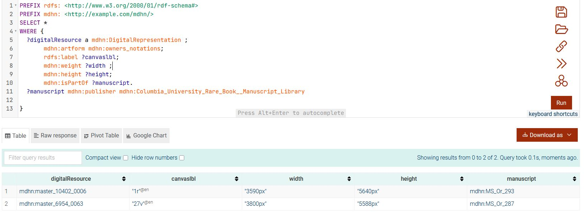

# Analysis of Openn Repository RDF Data

## Introduction
The TEI Ontology is a lightweight OWL (Web Ontology Language) ontology that defines classes, properties, and relationships to catalog digital resources in the OPenn collection. It integrates TEI metadata with Dublin Core terms to describe manuscripts, their digital representations, and associated metadata such as titles, creators, and formats. The ontology uses RDF (Resource Description Framework) and RDFS (RDF Schema) to structure knowledge, making it suitable for knowledge graph applications.

RDF excels at integrating data from various sources and making implicit data explicit. This is done through technologies like Load and Transfer pipelines, NER, and GraphDB storage. Below is a simplified process involving Pennsylvania’s OPEnn library from data harvesting to modeling discovered entities in a dynamic Knowledge Graph.

This document examines two RDF files from the Openn Repository, provided here in Turtle (TTL) format. They contain metadata for a manuscript and a taxonomy term, analyzing their structure, content, and role in the repository's knowledge graph.
The `CatalogeData` folder includes the full Turtle data compressed due to it's large file size, along with the `original TEI XML files` and `JSON serialization`. Both versions are identical.
For demonstration, the `SampleData` folder offers a subset of the data, with the full dataset available in compressed format.

## 1. Ontology 

## Key Components

### Prefixes and Namespaces
The ontology declares several standard prefixes to ground its vocabulary:

- `sc`: `schema.org` Our base ontology
- `tei`: Custom namespace for TEI-specific terms (`http://www.tei-c.org/ns/1.0#`)
- `dct`: Dublin Core Terms (`http://purl.org/dc/terms/`)
- `owl`, `rdf`, `rdfs`: Standard ontologies for semantic web
- `xsd`: XML Schema Datatypes
- `mdhn`: Local scoped namespace

These prefixes enable interoperability with existing semantic web standards.

### Classes
The ontology defines key classes to represent entities in the OPenn collection:

- `mdhn:GLAMPublisher` is subClassOf `sc:Organization`: Describes the institude/publisher of the manuscrpts.
- `mdhn:Manuscript` is subClassOf `sc:CreativeWork`: Describes physical manuscripts, linked to their publisher
- `mdhn:DigitalRepresentation` is subClassOf `sc:VisualArtwork`: Describes visual artwork, linked to their manuscript
- `mdhn:CanvasType` subClassOF `sc:DefinedTerm`: Models the canvas type of a `mdhn:DigitalRepresentation` instance.


Image 01


Actual digital resource correponding to each folio of a particular manuscript is represented by `tei:DigitalRepresentation`: 

**Image 02**

### Properties
Properties connect entities and their metadata:
- Object Properties:
  - `mdhn:isPartOf`: Links a folio of a manuscript (an instance of `mdhn:DigitalRepresentation`) to a Manuscript (an instance of `mdhn:Manuscript`) (e.g., `mdhn:master_0022_0000 mdhn:master_0022_0000 mdhn:Oversize_LJS_294`).
  - `mdhn:hasCanvas`: Indicates an inverse predicate of `mdhn:isPartOf`
  - `mdhn:artform`: Indicates canvas type of  `mdhn:DigitalRepresentation`. The values are from a local-scoped custom controlled vocabularies.  
  - `mdhn:hasInstances`: Indicates an inverse predicate of `mdhn:artform` 
  - `mdhn:publisher`: Indicates a GLAM which is the publisher of `mdhn:Manuscript` 

  - `mdhn:hasPublished`: Indicates an inverse predicate of  `mdhn:publisher`       
- Data Properties (from Dublin Core):
  - `mdhn:inLanguage`: The Language of a manuscript (e.g.,  Per, Ar, Ota, ...).
  - `mdhn:height`: The Height of a canvas in pixel.
  - `mdhn:width`: The width of a canvas in pixel
  - `mdhn:image`: URL of the image represented by the instances of `mdhn:DigitalRepresentation`.
  - `mdhn:additionalType`: Usually the url of full version of TEI XML file of a manuscript.
  - `mdhn:numberOfPages`: Number of images or canvaces of a manuscript.    

### Logical Structure
The ontology uses OWL to define class hierarchies and property constraints:
- `mdhn:DigitalRepresentation` and `mdhn:Manuscript` are subclasses of a generic resource concept, implicitly aligned with `owl:Thing`.
- Properties like `mdhn:isPartOf` have defined domains (`mdhn:DigitalRepresentation`) and ranges (`mdhn:Manuscript`), ensuring semantic consistency.

### SPARQL Query

This section provides sample SPARQL queries to demonstrate how to retrieve metadata from the [TEI Ontology](https://raw.githubusercontent.com/MehranDHN/KG4OPennResources/refs/heads/main/CatalogeData/TEIOntology.ttl) used for modeling digital resources in the OPenn collection. These queries are designed to work with a triple store (e.g., Apache Jena) containing the ontology and associated RDF data. 

## Prerequisites

- The `TEIOntology.ttl` file is loaded into a triple store.
- The ontology uses the following namespaces:
  - `mdhn`: `http://example.com/mdhn/`
  - `sc`: `hhttps://schema.org/`
- Queries assume RDF data describing manuscripts and digital resources, as per the ontology’s structure.

## Sample Queries

### 1. Retrieve All Manuscripts with Their Titles
This query fetches all resources classified as `mdhn:Manuscript` along with their `rdfs:label`.

```sparql
prefix mdhn: <http://example.com/mdhn/> 
prefix sc: <https://schema.org/> 

SELECT ?manuscript ?title
WHERE {
  ?manuscript a mdhn:Manuscript ;
              rdfs:label ?title .
}
```


**Use Case**: List all manuscripts in the OPenn collection with their titles for catalog browsing.

### 2. Find Digital Resources for a Specific Manuscript
This query retrieves Manuscripts and associated canvases with their CanvasType via `mdhn:artform`.

```sparql
prefix mdhn: <http://example.com/mdhn/> 
prefix sc: <https://schema.org/>

SELECT ?digitalResource ?canvastype ?image
WHERE {
  ?manuscript a mdhn:Manuscript ;
              rdfs:label "MS Codex 1234" ;
              mdhn:hasCanvas ?digitalResource .
  ?digitalResource mdhn:artform ?canvastype ;
                  mdhn:image ?image .
}
```

**Use Case**: Retrieve digital representations (e.g., file formats and URLs) for a manuscript named “MS Codex 1234” and their related canvases.

### 3. List Resources by Creator
This query finds all resources (manuscripts or digital resources) associated with a specific creator.

```sparql
prefix mdhn: <http://example.com/mdhn/> 
prefix sc: <https://schema.org/>

SELECT ?resource ?title
WHERE {
  ?resource mdhn:publisher dhn:Columbia_University_Rare_Book__Manuscript_Library ;
            rdfs:label ?title .
}
```

**Use Case**: Identify all manuscripts in the collection attributed to a Columbia University.

### 4. Find Folios of all the Manuscrpts from specified publisher
This query retrieves all folios of `mdhn:owners_notations` type with their dimension and label that belong to manuscripts published by Columbia University.

```sparql
prefix mdhn: <http://example.com/mdhn/> 
prefix sc: <https://schema.org/>

SELECT *
WHERE {
  ?digitalResource a mdhn:DigitalRepresentation ;       
       mdhn:artform mdhn:owners_notations;
       rdfs:label ?canvaslbl;
       mdhn:weight ?width ;
       mdhn:height ?height;
       mdhn:isPartOf ?manuscript.
  ?manuscript mdhn:publisher mdhn:Columbia_University_Rare_Book__Manuscript_Library

}
```

**Use Case**: List all the folios of specified type from a particular publisher.

**Query 04**

### 5. Retrieve list of GLAMs (Publishers)
This query finds all GLAM publishers

```sparql
PREFIX rdfs: <http://www.w3.org/2000/01/rdf-schema#>
PREFIX mdhn: <http://example.com/mdhn/>
SELECT *
WHERE {
  ?publisher a mdhn:GLAMPublisher ;       
        rdfs:label ?publisherlbl.
}
```

**Use Case**: Identify all publishers.

**Query 05**
### 6. VisualArtwork Statistic categorized by `sc:artForm`
This query results an ordered list of counting `sc:VisualArtwork` instances groupped by `sc:artForm` except those that have `mdhn:ordinary` values.

```sparql
PREFIX mdhn: <http://example.com/mdhn/>
PREFIX rdfs: <http://www.w3.org/2000/01/rdf-schema#>
PREFIX sc: <https://schema.org/>

prefix onto:<http://www.ontotext.com/>
select ?artform (Count(?s) as ?canvascount) {
    ?s a mdhn:DigitalRepresentation ;
       mdhn:artform ?artform.
    FILTER(?artform!=mdhn:ordinary)
}
group by ?artform
order by Desc(?canvascount)
```

**Use Case**: Useful statistic to identify number of canvas types. Some valid instances are : 
`mdhn:diagram`, `mdhn:table`, `mdhn:illustration`, `mdhn:illuminated_text`, `mdhn:illuminated_headpiece`, `mdhn:notations` , ...

**Image 03**

### 7. All manuscripts and the count of their canvases(folios)
This query results an descendant ordered list of counting `sc:VisualArtwork` instances groupped by `mdhn:Manuscript`. The result is filtered based on english language title of each manuscript. 

```sparql
PREFIX rdfs: <http://www.w3.org/2000/01/rdf-schema#>
PREFIX mdhn: <http://example.com/mdhn/>

Select ?cho ?title  (COUNT(?canvas) as ?counter){
    ?canvas a mdhn:DigitalRepresentation;
         mdhn:isPartOf ?cho. 
    ?cho rdfs:label ?title.
    FILTER(Lang(?title) in ("en"))
}
group by ?cho ?title
order by desc(?counter)

```

**Use Case**: Important statistic about number of manuscripts and counting the canvases of each manuscript.

**Image 04**

## Integration in Repository

To use these queries:
1. Store the `TEIOntology.ttl` file and related RDF data in your repository’s data directory.
2. Set up a triple store (e.g., Apache Jena, RDF4J) to load the ontology and data.
3. Execute these SPARQL queries using a SPARQL endpoint or a library like `rdflib` in Python.
4. Include these examples in your README to guide users on querying the knowledge graph.

## Notes

- Replace placeholder values (e.g., “MS Codex 1234”, “John Doe”) with actual data from your RDF dataset.
- Ensure the triple store supports the ontology’s namespaces and data structure.
- For large datasets, consider adding `LIMIT` or `OFFSET` to queries to manage result sizes.

These queries enhance the discoverability of OPenn resources by leveraging the TEI Ontology’s semantic structure.


## First-Order Logic (FOL) Statements

To formalize the ontology’s semantics, we express key relationships and constraints in First-Order Logic. These statements capture the logical underpinnings of the ontology, suitable for reasoning and validation.

1. **Class Membership**:
   - Every GLAM Publisher is an Organization.
     ```fol
     ∀x (GLAMPublisher(x) → Organization(x))
     ```
   - Every manuscript is a `mdhn:CreativeWorks`.
     ```fol
     ∀x (Manuscript(x) → mdhn:CreativeWorks(x))
     ```
   - Every Digital Representation is a `mdhn:VisualArtwork`.
     ```fol
     ∀x (DigitalRepresentation(x) → VisualArtwork(x))
     ```

   - isPartOf associates an istances of `mdhn:DigitalRepresentat` to an isnatce of `mdhn:Manuscript`
     ```fol
     isPartOf(x,y) → mdhn:DigitalRepresentation(x)
     isPartOf(x,y) → mdhn:Manuscript(y)
     ```


2. **Property Relationships**:
   - A manuscript has a publisher
     ```fol
     ∀x∀y (mdhn:publisher(x, y) → (mdhn:Manuscript(x) ∧ mdhn:GLAMPublisher(y)))
     ```
   - A digital resource has canvas type(s)
     ```fol
     ∀x∀y (mdhn:artform(x, y) → (mdhn:DigitalRepresentation(x) ∧ mdhn:CanvasType(y)))
     ```

3. **Metadata Constraints**:
   - Every resource has at least one title (a string).
     ```fol
     ∀x (Resource(x) → ∃y (title(x, y) ∧ string(y)))
     ```
   - Every digital resource has a format.
     ```fol
     ∀x (DigitalRepresentation(x) → ∃y (format(x, y) ∧ string(y)))
     ```

These FOL statements ensure that the ontology’s relationships are logically consistent and can be used for automated reasoning, such as checking if a manuscript’s digital representation is correctly typed.

## Usage in OPenn Collection

The TEI Ontology is tailored for the OPenn collection, which hosts digitized manuscripts from institutions like the University of Pennsylvania. It enables:
- **Metadata Interoperability**: By using Dublin Core and TEI standards, the ontology supports integration with other digital libraries.
- **Knowledge Graph Construction**: The RDF-based structure allows for querying and visualizing relationships (e.g., manuscripts to their digital images).
- **Semantic Queries**: SPARQL queries can retrieve resources by title, creator, or format, enhancing discoverability.

## Example

Consider a manuscript “Shāhnāmah” and its two digital representations (folios 141v and 142r) that published by the Free Library of Philadelphia:
- **RDF Triples** (simplified):

```turtle
mdhn:Lewis_O_56 a mdhn:Manuscript ;
    rdfs:label "Shāhnāmah."@en,
        "[شاهنامه]"@fa ;
    rdfs:comment "Third volume of the Shāhnāmah with 13 miniatures."@en ;
    mdhn:about mdhn:17th_century,
        mdhn:18th_century,
        mdhn:747_1500,
        mdhn:Early_works_to_1800,
        mdhn:Specimens ;
    mdhn:additionalType "https://openn.library.upenn.edu/Data/0023/lewis_o_056/data/lewis_o_056_TEI.xml"@en ;
    mdhn:identifier "Lewis O 56"@en ;
    mdhn:image "https://openn.library.upenn.edu/Data/0023/lewis_o_056/data/thumb/7209_0000_thumb.jpg"@en ;
    mdhn:inLanguage "per"@en ;
    mdhn:numberOfPages 310 ;
    mdhn:publisher mdhn:Free_Library_of_Philadelphia_Special_Collections ;
    mdhn:url ""@en .

mdhn:master_7209_0291 a mdhn:DigitalRepresentation ;
    rdfs:label "141v"@en ;
    mdhn:artform mdhn:ordinary ;
    mdhn:height "9792px" ;
    mdhn:image "https://openn.library.upenn.edu/Data/0023/lewis_o_056/data/web/7209_0291_web.jpg"@en ;
    mdhn:isPartOf mdhn:Lewis_O_56 ;
    mdhn:weight "6607px" .

mdhn:master_7209_0292 a mdhn:DigitalRepresentation ;
    rdfs:label "142r"@en ;
    mdhn:artform mdhn:ordinary ;
    mdhn:height "9792px" ;
    mdhn:image "https://openn.library.upenn.edu/Data/0023/lewis_o_056/data/web/7209_0292_web.jpg"@en ;
    mdhn:isPartOf mdhn:Lewis_O_56 ;
    mdhn:weight "6607px" .    


mdhn:Free_Library_of_Philadelphia_Special_Collections a mdhn:GLAMPublisher ;
    rdfs:label "Free Library of Philadelphia, Special Collections"@en .    
  ```


## Integration in Repository

To use the ontology in repository:
1. Include the `TEIOntology.ttl` file in your project’s data directory.
2. Reference it in your README to explain how it models OPenn resources.
3. Provide SPARQL query examples to demonstrate retrieval of manuscript metadata.
4. Use a triple store (e.g., Apache Jena) to load and query the ontology.


## 2. Sample RDFData_01.ttl
**URL**: [RDFData_01.ttl](https://raw.githubusercontent.com/MehranDHN/KG4OPennResources/SampleData//refs/heads/main/RDFData_01.ttl)

### Overview
- **Format**: Turtle (TTL).
- **Purpose**: For demonstration purpose of the Metadata for a specific manuscript (Lewis O 63: Khamsah, Lewis C 1: Quran).
- **Content**: Detailed metadata including title, description, creator, and links to digital images.

### Structure and Key Components
1. **Prefixes and Namespaces**:
   - Standard vocabularies: `rdf:`, `rdfs:`, `dct:`, `foaf:`, `schema:`, `bibo:`.
   - Custom namespace: `<http://www.openn.library.upenn.edu/Data/0001/html/>`.

2. **Main Resource**:
   - URI: `<http://www.openn.library.upenn.edu/Data/0001/MsColl390Item1037>`.
   - Type: `bibo:Manuscript`.
   - Metadata:
     - **Title**: "Ms. Coll. 390, Item 1037 - Bhāgavatapurāṇa. Prahlādacarita".
     - **Description**: 19th-century illustrated manuscript with 108 leaves and 25 miniatures.
     - **Language**: Sanskrit (`<http://id.loc.gov/vocabulary/iso639-2/san>`).
     - **Creator**: Keśavaśaraṇa.
     - **Date**: 19th century ("18uu").
     - **Extent**: 108 pages.
     - **Subject**: Hindu mythology (`<http://id.loc.gov/authorities/subjects/sh85062949>`).
     - **Publisher**: University of Pennsylvania Libraries.
     - **Rights**: Creative Commons Attribution License.

3. **Relationships**:
   - Part of collection: `<http://www.openn.library.upenn.edu/Data/0001/MsColl390>`.
   - Digital images: Linked via `foaf:thumbnail`, `foaf:depiction`, `schema:associatedMedia`.
   - Taxonomy: Linked to `<http://www.openn.library.upenn.edu/Data/0001/html/Taxonomy_HinduMythology>`.


## 3. Taxonomy_RDF_Data.ttl
**URL**: [Taxonomy_RDF_Data.ttl](https://raw.githubusercontent.com/MehranDHN/KG4OPennResources/refs/heads/main/Taxonomy_RDF_Data.ttl)

### Overview
- **Format**: Turtle (TTL).
- **Purpose**: Defines combined version of taxonomy terms which are instances of the `sc:Taxon`. ("Hindu Mythology") for resource classification.
- **Content**: SKOS-based description of a single concept.

### Structure and Key Components
1. **Prefixes and Namespaces**:
   - Standard vocabularies: `rdf:`, `rdfs:`, `skos:`, `dct:`, `foaf:`, `schema:`.
   - Custom namespace: `<http://www.openn.library.upenn.edu/Data/0001/html/>`.

2. **Main Concept**:
   - URI: `<http://www.openn.library.upenn.edu/Data/0001/html/Taxonomy_HinduMythology>`.
   - Type: `skos:Concept`.
   - Metadata:
     - **Label**: "Hindu Mythology"@en.
     - **Definition**: "Stories, beliefs, and traditions concerning the gods and heroes of the Hindu religion."@en.
     - **Broader Concept**: `<http://www.openn.library.upenn.edu/Data/0001/html/Taxonomy_Mythology>`.
     - **Related**: Library of Congress subject heading (`<http://id.loc.gov/authorities/subjects/sh85062949>`).
     - **Creator**: University of Pennsylvania Libraries.
     - **Date Issued**: "2023-10-25".

3. **Relationships**:
   - Part of scheme: `<http://www.openn.library.upenn.edu/Data/0001/html/Taxonomy_Scheme>`.
   - Hierarchical link via `skos:broader`.


## Contextual Analysis
- **Project**: KG4OPennResources aims to build a knowledge graph for Openn Repository resources.
- **Roles**:
  - `RDFData_01.ttl`: Describes a manuscript, linking to taxonomy for classification.
  - `Taxonomy_RDF_Data.ttl`: Provides controlled vocabulary for categorization.
- **Use Case**: Supports digital humanities research and Linked Open Data integration.
- **Improvements**:
  - Expand taxonomy to include more terms.
  - Validate URIs for resolvability.
  - Enhance repository documentation.

## Conclusion
The RDF files demonstrate a robust approach to digitizing and semantically enriching Openn Repository manuscripts. They leverage RDF, CIDOC CRM, Schema.org and SKOS for interoperability, supporting discovery and research in cultural heritage.

---
*Generated on May 4, 2025, by **MehranDHN**, powered by: Grok 3 (xAI).*
